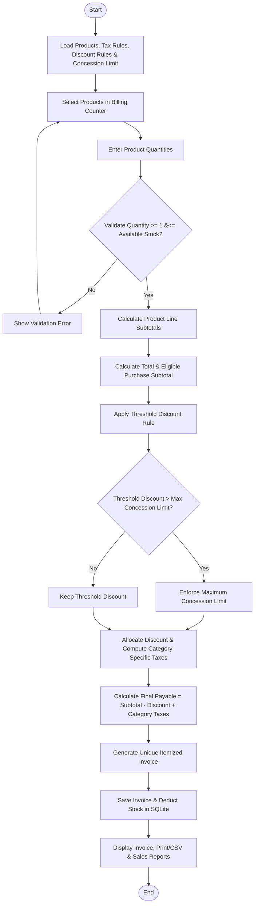

# Flowchart — Smart Retail Billing & Discount System

Below is the complete execution flowchart for the retail billing workflow using Mermaid syntax.

```mermaid
flowchart TD
    A(["Start"]) --> B["Load Products, Tax Rules, Discount Rules & Concession Limit"]
    B --> C["Select Products in Billing Counter"]
    C --> D["Enter Product Quantities"]
    D --> E{"Validate Quantity >= 1 &<= Available Stock?"}
    E -- "No" --> F["Show Validation Error"]
    F --> C
    E -- "Yes" --> G["Calculate Product Line Subtotals"]
    G --> H["Calculate Total & Eligible Purchase Subtotal"]
    H --> I["Apply Threshold Discount Rule"]
    I --> J{"Threshold Discount > Max Concession Limit?"}
    J -- "Yes" --> K["Enforce Maximum Concession Limit"]
    J -- "No" --> L["Keep Threshold Discount"]
    K --> M["Allocate Discount & Compute Category-Specific Taxes"]
    L --> M
    M --> N["Calculate Final Payable = Subtotal - Discount + Category Taxes"]
    N --> O["Generate Unique Itemized Invoice"]
    O --> P["Save Invoice & Deduct Stock in SQLite"]
    P --> Q["Display Invoice, Print/CSV & Sales Reports"]
    Q --> R(["End"])
```
